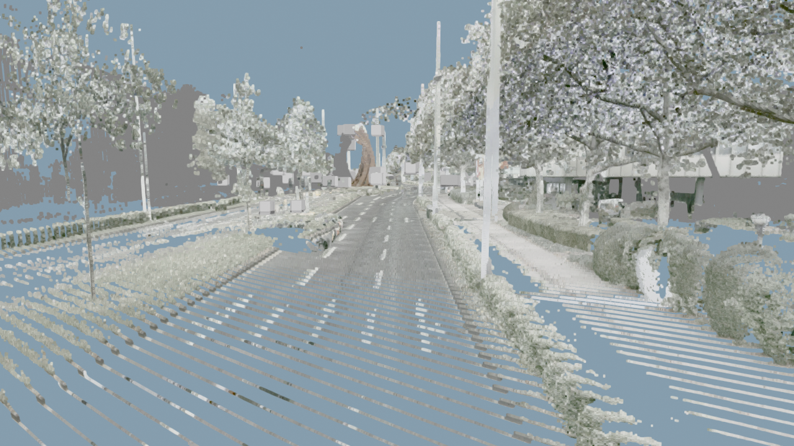

# HD Map Generation Pipeline

A six-stage pipeline that turns raw mobile-mapping data (fisheye camera frames + LiDAR point clouds) into an HD map: undistorted imagery, detected/localised road signs and traffic lights, cleaned point clouds, lane markings, a colorised point cloud fusing camera RGB onto LiDAR geometry, and multi-pass corridor fusion validated against OpenStreetMap.

The pipeline is demonstrated end to end on one real tile from a mobile-mapping survey driven through Bonn, Germany, referred to throughout as `part15`; the final stage extends this to a real ~1.13 km multi-tile corridor from the same survey.



## Pipeline stages

```
camera_preprocessing        undistort fisheye frames, fix exposure/color cast
        |
camera_feature_extraction   detect + localise signs and traffic lights
        |
lidar_preprocessing         RANSAC ground extraction, keep road + vertical infra
        |
lidar_feature_extraction    lane markings from intensity, Lanelet2/OSM export,
                             semantic point-cloud visualisation
        |
rgb_pointcloud_fusion       calibrate cameras, register poses, project LiDAR
                             into images, extract RGB back onto the point cloud
        |
corridor_fusion_and_        fuse multiple revisit passes of the same road,
  validation                validate localized poles/signs/lights against OSM,
                             render a first-person drive-through
```

`camera_preprocessing` and `camera_feature_extraction` feed `lidar_feature_extraction` (signs/lights get baked into the OSM export and the semantic point cloud). `rgb_pointcloud_fusion` is a separate, self-contained calibration-to-colorization chain; its output colorized point cloud is also read back into `camera_feature_extraction` as an optional signal for keeping detections off the drivable road surface. `corridor_fusion_and_validation` builds on `rgb_pointcloud_fusion` (using a corrected calibration convention, see that stage's README) and `camera_feature_extraction`'s detections, extending single-tile colorization to multi-pass corridor fusion and adding an external accuracy check against OpenStreetMap.

Each section directory has its own README covering exact input/output formats.

## Demo data

`data/part15/` holds everything needed to run the pipeline against one real tile:

- `raw/9020C-0140_08.05.2026_08.10.22_MoRo_Bonn.all.part15.laz`: the raw LiDAR tile, ~16.4M points.
- `images/part15_left_01.jpg` … `_10.jpg`: 10 frames from one fisheye camera (the left-facing unit, not the upward-facing one), spaced across the tile.
- `results/colorized_part15.laz`: the fused output, this tile's points colored from the left, right, and down-facing cameras (the upward camera is excluded, since it mostly sees sky).

`config/` holds the shared calibration inputs several stages need:

- `CamExtr.json`: per-frame camera pose + serial number records for the survey.
- `9020C_0140_toScanner_final.xml`: per-camera fisheye intrinsics (focal length, principal point, Kannala-Brandt distortion coefficients).

The 10 demo images were picked to exclude frames with a clearly legible license plate; a couple of nearby frames in the source sequence had one and were swapped out.

## Setup

```bash
python3 -m venv venv
source venv/bin/activate
pip install -r requirements.txt
```

`camera_feature_extraction` additionally needs a trained sign detector and a 76-class sign classifier. Those weights aren't bundled here (see that section's README): either train your own or point the script at any YOLO-format detector/classifier pair.

## Known limitations

- **Camera pre-processing**: the automatic white-balance + olive-desaturation pass can overcorrect bright sky into a magenta cast on some frames. See `camera_preprocessing/README.md`.
- **RGB/point cloud fusion**: reprojection accuracy in the stage-5 chain is coarse (roughly 700-1150 px mean error on a 2448x2048 image per the fusion code's own diagnostics), so colorization is visibly smeared/offset rather than pixel-accurate. See `rgb_pointcloud_fusion/README.md`. `corridor_fusion_and_validation` uses a corrected calibration convention that fixes this; see that stage's README.
- **LiDAR pre-processing**: works from a re-run on this machine's copy of the data; a separate, more advanced Patchwork++-based ground segmentation was developed for this project but produced no output on this machine and isn't included here.
- **Corridor fusion and validation**: every accuracy number is checked against OSM or the pipeline's own internal consistency, never against a dedicated ground-control-point survey, so absolute trueness (as opposed to precision) is still unverified. See `corridor_fusion_and_validation/README.md`.

## Repository layout

```
config/                          shared camera calibration (CamExtr.json, intrinsics XML)
data/part15/                     demo LiDAR tile, camera frames, and fused output
camera_preprocessing/            Stage 1
camera_feature_extraction/       Stage 2
lidar_preprocessing/             Stage 3
lidar_feature_extraction/        Stage 4
rgb_pointcloud_fusion/           Stage 5
corridor_fusion_and_validation/  Stage 6
requirements.txt
```
