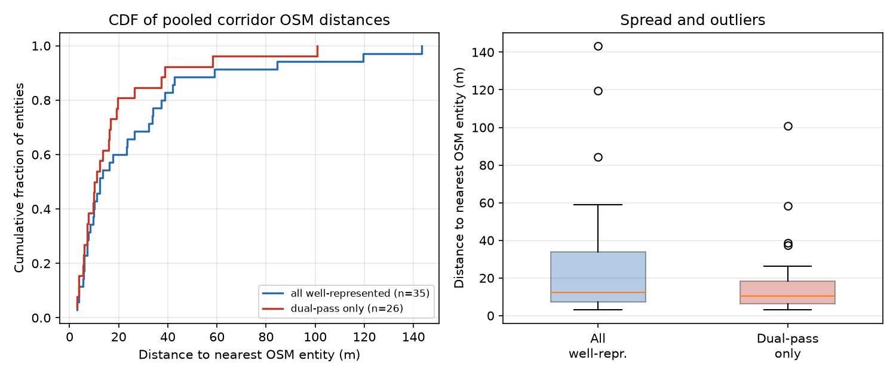
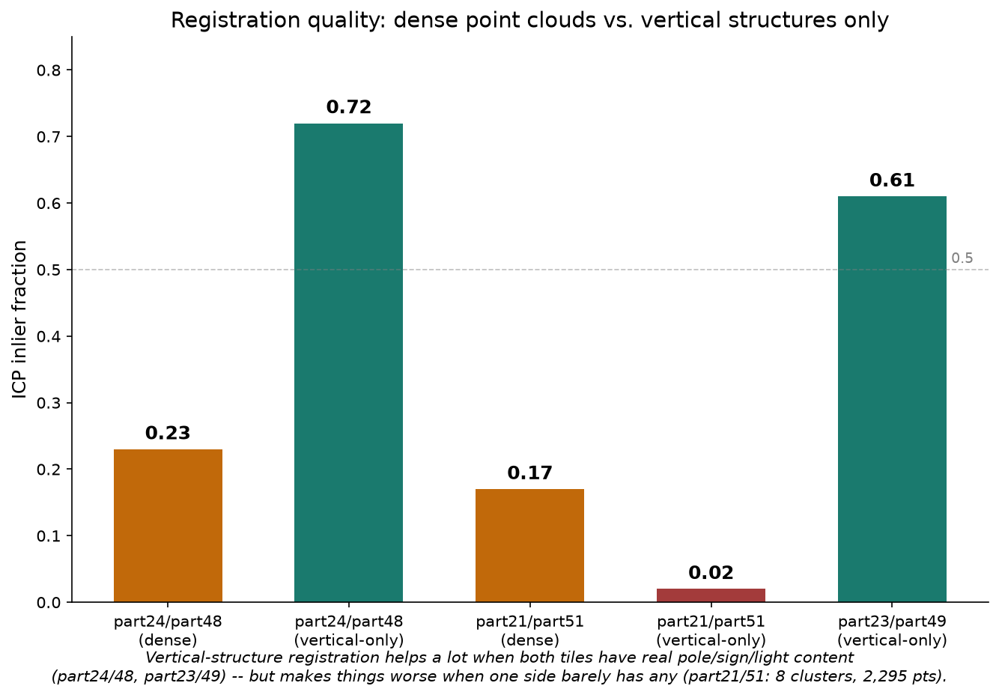
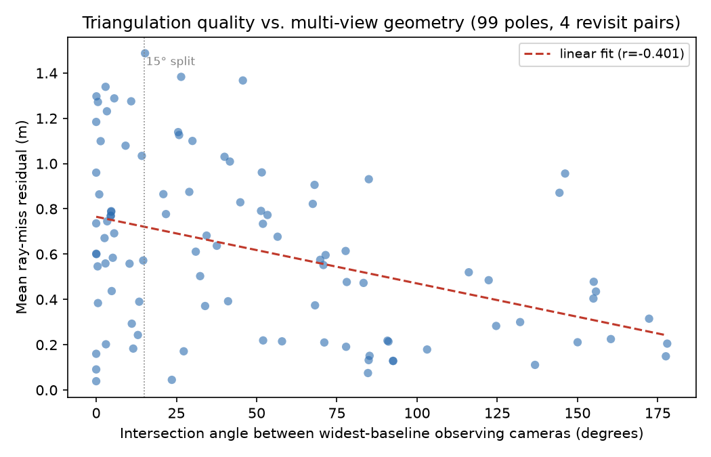
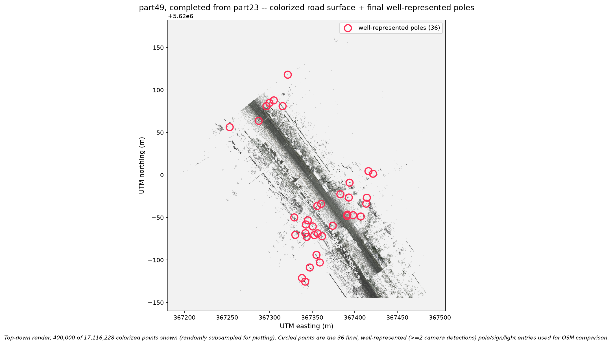
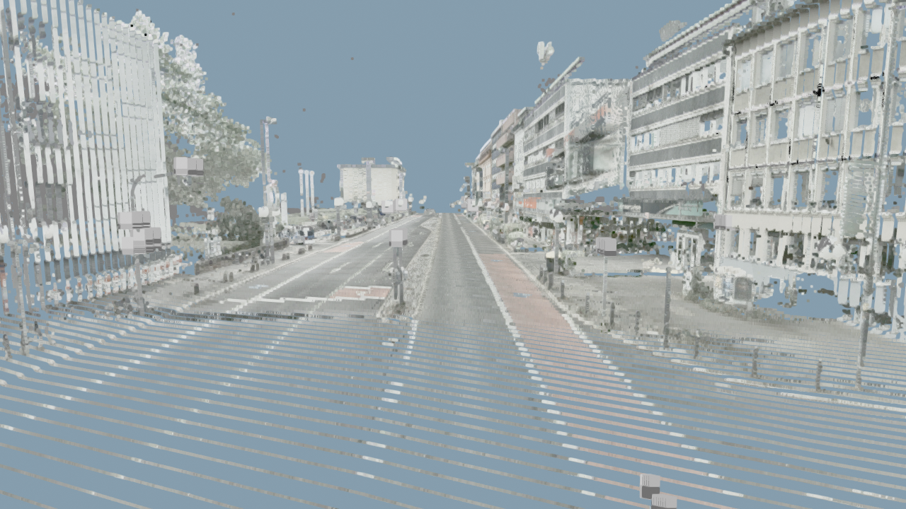

# Corridor fusion and validation

Takes the single-tile pipeline (stages 1-5) further in two directions: fusing multiple LiDAR passes of the *same* road into one denser, more complete point cloud, and honestly checking how accurate the resulting map actually is against an external reference (OpenStreetMap) rather than only reporting internal consistency.

This stage also fixes the calibration convention behind `rgb_pointcloud_fusion`'s documented 700-1150 px reprojection error: `colorize_pointcloud.py` here uses the `rotMat(*Hrp)` direct-order convention (not the `xyz` Euler convention used previously), confirmed pixel-accurate against real LiDAR/image data. Every colorized point cloud shown below and the `part47`-`part50` drive-through were produced with this corrected calibration.

Demonstrated on a real ~1.13 km corridor of the same Bonn survey: four tile pairs where the vehicle drove the same stretch of road twice, 12-15 minutes apart, on outbound and return legs.


## What's here

**Multi-pass revisit fusion** — register two independent passes of the same road onto each other and merge them into one denser cloud.

| Script | Does |
|---|---|
| `phase0_image_fix.py` | per-image exposure/undistortion pass feeding the colorizer |
| `phase2_strip_ground_v3.py`, `phase2_road_and_vertical.py`, `phase2_vertical_only_v8.py` | RANSAC ground-plane extraction, hardened against degenerate near-vertical facade planes; splits each tile into road-surface and vertical-structure (pole/sign/light) subsets |
| `register_via_vertical.py` | registers one pass onto another using only the vertical-structure points (poles, signs, lights) as correspondence targets — a real, measured improvement over dense-cloud ICP when both tiles have enough vertical infrastructure to anchor on |
| `merge_overlapping_tiles.py`, `merge_trust_flag.py` | 3D ICP point-cloud registration (Kabsch/SVD rigid transform) between two revisit tiles, with an RMS-based trust flag so a degenerate/unconverged solve gets caught rather than silently trusted |
| `gapfill_recipient_from_donor.py` | adds only the genuinely-missing points from the denser pass into the sparser tile (real nearest-surface distance check, not naive full replacement) |
| `colorize_pointcloud.py` | occlusion-aware colorization (per-image z-buffer, bilinear sampling) with the corrected calibration convention; also bakes STVO hover-label sign/light tags into the cloud as small 3D billboards |
| `combine_colorized.py` | unions a recipient tile's own colorized points with its colorized gap-fill |

**Pole/sign/light extraction and OSM validation** — turn the fused cloud's detections into map entities and check them against an independent reference.

| Script | Does |
|---|---|
| `detect_signs_lights_sam3.py` | 2D sign/light detection on the source camera imagery |
| `phase4c_stvo_sprites.py` | renders StVO-compliant sign/light billboards |
| `extract_and_snap_poles.py` | clusters detections into physical poles, LiDAR ray-cast localization |
| `compare_pointcloud_poles_osm.py` | groups poles by nearest OSM entity (not the other way around — matches OSM's own logical-intersection-point data model) and reports the match distance |
| `pool_all_pairs_osm.py` | pools poles across every successfully-fused revisit pair and re-runs the entity comparison once over the combined set, avoiding double-counting entities more than one pair happened to match |

**Precision and consistency checks** — how good is this without an external reference, and does the pipeline's own geometry predict where it's weak.

| Script | Does |
|---|---|
| `precision_assessment.py` | Gauss-Helmert plane fit on a real flat road patch: measures internal LiDAR precision (mm-level) independent of any external reference |
| `refine_triangulation.py` | Gauss-Newton reprojection-error refinement (Space Intersection: camera poses held fixed, robust Huber kernel) |
| `cross_pass_consistency_check.py` | triangulates the same pole from each pass's camera observations independently and measures how far apart the two answers land, with an RMS-based trust filter to exclude solves that never converged |
| `geometric_degeneracy_analysis.py` | tests whether triangulation quality actually depends on viewing geometry — computes the real intersection angle between each pole's widest-baseline observing cameras from the survey's own camera-pose log and correlates it against triangulation residual |
| `loop_closure_icp.py`, `pose_graph_slam.py` | 2D/3D loop-closure ICP and Gauss-Newton pose-graph optimization for trajectory drift correction, validated on synthetic self-tests and real revisit data |

**Visualization** — render the fused, validated corridor as a first-person drive-through.

| Script | Does |
|---|---|
| `build_corridor_driveThrough.py` | merges the fused tiles and bakes STVO hover-label stickers across the whole corridor in one pass |
| `render_corridor_driveThrough.py` | offscreen-renders a first-person fly-through along the real recorded vehicle trajectory, full native point density, assembled into an MP4; auto-detects and trims any trailing stretch where the trajectory runs past the cloud's actual coverage |
| `visualize_pipeline_result.py` | static renders/plots of pipeline output for review |

`pipeline.py` wires the precision/loop-closure/pose-graph steps together end to end against real tile data, honestly reporting a step as skipped-with-reason (rather than silently omitted) when the data doesn't support it — e.g. a single-pass tile has no loop closures to find.

`transformationTools.py` and `geodetic_tools.py` are shared coordinate-frame and UTM/geodetic utilities used throughout.

## Results

Pooling every well-represented pole across the four successfully-registered revisit pairs and comparing against real OpenStreetMap traffic-signal data (63 entities fetched via the Overpass API for this corridor):

| Tier | Poles | OSM entities | Mean | Median | Range |
|---|---:|---:|---:|---:|---:|
| All well-represented | 91 | 35 | 26.26 m | 12.28 m | 2.99–143.41 m |
| Dual-pass only | 56 | 26 | 18.00 m | 10.99 m | 2.99–100.92 m |



15 of 35 entities (43%) land within 10 m of their matched OSM node. The mean is pulled up by four entities beyond 50 m; two of those are backed by only 1-2 poles (weak, single-detection positions), but the other two are backed by 7 independent poles each — a strong internal signal that the pipeline's own position is stable there, which points more toward "the nearest OSM entity isn't the right one" (OSM has no correct entity to match against everywhere) than toward a pipeline error. This project cannot fully separate the two without an independent ground-control-point survey.

**Registration quality varies by pair, and that variation shows up directly downstream.** Two of six attempted revisit pairs were abandoned outright when neither dense-cloud nor vertical-structure registration converged with confidence, rather than publishing a result built on an untrustworthy transform:



**Triangulation residual correlates with viewing geometry, not just detection quality.** Testing all 99 poles' actual intersection angle (computed from real camera positions, not assumed) against the triangulation solver's own residual:



Poles seen only from a narrow angle (<15°) show a 40% higher median residual than poles seen from a wider spread of angles — evidence that some of this pipeline's less-precise results are a geometry constraint of the drive path, not a detection-quality problem, and that a full bundle adjustment (allowing small pose corrections, rather than holding poses fixed) is the more direct fix.





## Known limitations

- **No absolute trueness check.** Every number above measures *precision* (agreement with itself) or *agreement with OSM*, never verified against a dedicated ground-control-point survey. Camera and LiDAR-derived positions both trace back to the same vehicle GNSS/INS trajectory as their shared global anchor, so a systematic drift in that shared chain would bias every check here identically and never surface as a disagreement — only an independent GNSS receiver with no connection to the survey vehicle's own trajectory could catch it.
- **Small sample sizes.** 35 OSM entities (26 dual-pass) is real, but still not large enough to report a confidence interval on or treat as a general expected-error rate.
- **Two of six attempted revisit pairs had to be abandoned** when neither registration strategy converged with confidence — a real, honestly-reported limitation of the registration step, not hidden by only showing the pairs that worked.
- **A ~3.6x point-density difference between two passes of the same street is reported but not explained.** Vehicle speed was checked and ruled out; the remaining candidates (LiDAR scanner configuration, active-head count, a logging issue) need the original raw sensor logs to investigate further, which this project does not have access to.
- **OSM's own positional accuracy is unmeasured.** The comparison above reports `pipeline error + OSM mapping error` combined; the two have not been separated by checking OSM nodes against independent orthophoto imagery.

## Setup

Same environment as the rest of this repo (`pip install -r ../requirements.txt`); `open3d`, `laspy`, `scipy`, and `pyproj` are already in there and cover this stage's renderer, registration, and geodetic needs.

**Most scripts here were written against this project's own multi-tile corridor dataset** (61 sequential survey tiles, not just the single `part15` tile bundled in `data/`), and several still have that dataset's absolute paths as module-level constants rather than full CLI arguments — a known gap versus `rgb_pointcloud_fusion`'s cleaner CLI-driven scripts. `render_corridor_driveThrough.py` and `build_corridor_driveThrough.py` are the two exceptions with real `--laz`/`--out`/`--pass` CLI flags; the rest will need their path constants edited to point at your own tile data before running. The demo data in `data/part15/` is enough to exercise the single-tile scripts (`precision_assessment.py`, `refine_triangulation.py`, `loop_closure_icp.py`, `pose_graph_slam.py` all ran against it directly, see `pipeline.py`); the multi-pass fusion and corridor-drive-through scripts need a second revisit tile of the same road, which isn't included in this repo's demo data.

The renderer needs a working OpenGL context; run with `XDG_SESSION_TYPE=x11` and `WAYLAND_DISPLAY` unset if running headless under Wayland.

```bash
python render_corridor_driveThrough.py \
    --laz path/to/fused_and_labeled_corridor.laz \
    --out corridor_driveThrough.mp4 \
    --renderer hq --label-split <point-index-where-labels-start>
```
